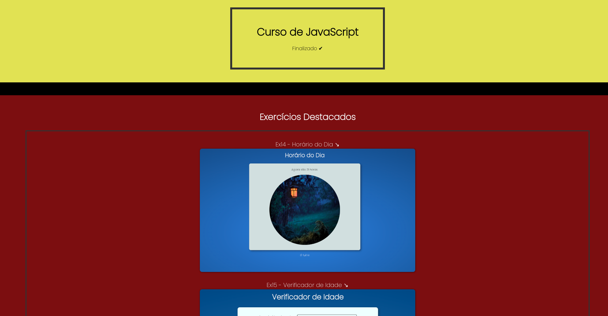

# Estudonauta-JavaScript-Language

## About
Site to encompass the main exercises proposed at <a href="https://estudonauta.com">Estudonauta</a> JavaScript course.

## Result

Access the project <a href="https://luk4x.github.io/Estudonauta-Linguagem-JavaScript/">HERE</a>

## Contributors Contact
<table>
  <tr>
    <td align="center">
      <a href="https://www.linkedin.com/in/lucasmacielf/">
         
        
          <b>Lucas Maciel</b>
        
      </a>
    </td>
  </tr>
</table>
